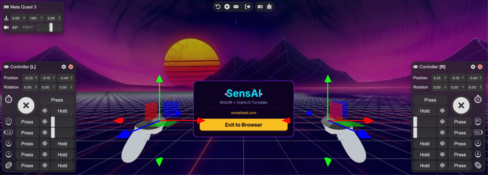

# sensai-webxr-worldmodels

This repository contains everything you need to get started with worldmodels in WebXR.

## Getting Started
Prequisites (Node >= 20.19.0, WebXR capable Browser, HMD optional)
npm install, npm run dev
Project Structure: tree
How to Add Your Own Splat

## SensAI Helpers

### Gaussian Splat Loader
- allows to easily load and unload local or remote .spz / .ply splats and attach them to the SceneGraph 
- can specify collision mesh for physics and locomotion

### Gaussian Splat Animator

- GPU accellerated appear / disappear effect 

## Worldmodels
- using .spz or .ply
- Pivot / positioning / scale
- GaussianSplatLoader

### Marble (WorldLabs)
- reccomended to use WorldLabs Marble (-> download low / high as .ply)
- collision handling (download mesh and add)
- API integration
- consider hosting large splat files outside of your repo (Cloudflare bucket reccomended)

### SparkJS
- made by Worldlabs https://sparkjs.dev/
- simple and performant rendering of gaussian splats

***Performance Tips***
- large splats can be hard on standalone (Quest / PICO) -> propose LOD system from SparkJS

## IWSDK 
see https://elixrjs.io/

### Headset simulator

How to use

### UI
see https://iwsdk.dev/guides/10-spatial-ui-uikitml.html
The default render order doesn´t work so a fix to ensure splats render below the IWSDK UI is applied in the splat loader. 
This can cause the pointer to falsely evaluate it´s size, so it is fixed

### Interactions and Locomotion 

- Built in interactions like 1/2H grab and distance grab
https://iwsdk.dev/guides/06-built-in-interactions.html
- Teleport, smooth locomotion and snap turn enabled
see https://iwsdk.dev/concepts/locomotion/
Note: we disabled the separate worker for locomotion for simplicity sake, if performance is lacking, you can enable it 

### Spatial Editor

- disabled by default (how to add)
- why it can make sense to have, depending on your workflow (do you add splats at runtime or is the env prebuild/configured)

## Testing and Deployment
- see https://elixrjs.io/guides/08-build-deploy.html
- use npm run dev 

- ***reccomended deployment workflow*** is to deploy on cloudflare worker (free, see https://blog.cloudflare.com/workers-sites/)